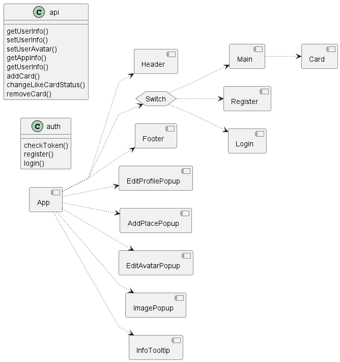
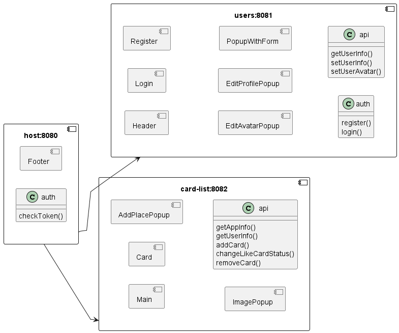

# Sprint# 1

##  1. Разделение проекта Mesto на несколько микрофронтендов

### Схема текущей реализации

### Обоснование выбора технологии
Module Federation — это библиотека для создания микрофронтендов. Она позволяет различным частям  приложения общаться друг с другом и эффективно делиться кодом. Это упрощает и ускоряет обновление и поддержку вашего приложения.

Single-SPA — это другой способ создания микрофронтендов, но он немного сложнее. Он больше похож на набор правил, которые определяют, как разные части вашего приложения должны взаимодействовать.

Почему Module Federation лучше?
* Проще в использовании: Легче настроить и понять.
* Более быстрая работа: Код загружается быстрее, что делает приложение более отзывчивым.
* Большая гибкость: Можно изменять части приложения, не затрагивая все остальное.
* Автоматическое совместное использование зависимостей: Module Federation автоматически делится зависимостями между приложениями, в то время как для Single-SPA требуется ручная настройка.
* Более простая интеграция: Module Federation бесшовно интегрирует приложения во время сборки/выполнения без дополнительных фреймворков, в отличие от ручной маршрутизации в Single-SPA.
* Меньше накладных расходов: Работает в рамках Webpack без необходимости в новом фреймворке, как у Single-SPA.
* Лучше масштабируется: Проще управлять большими и сложными проектами.
* Доступность документации: Документация по Module Federation более доступна.

### Схема предлагаемой реализации

Предлагается выделить 2 основных микрофронтенда: один - отвечающий за работу с фотографиями пользователя, в т.ч. и за учёт лайков; второй - за работу с профилем пользователя. Учитывая, что приложение имеет встроенную систему аутентификации, функции по регистрации/аутентификации пользователя предлагается не выделять в отдельный фронтенд и оставить в профиле.

Соответственно, компоненты, отвечающие за тот или иной функционал должны быть отнесены к соответсвующему микрофронтенду согласно приведённой схеме.

Для управления работой микрофронтендов необходимо реализовать host приложение, которое "собирает" приложение целиком и которое будет являться главной точкой входа. Компоненты, не несущие функциональности и служащие для целей оформления внешнего вида приложения предлагается перенести в host приложение.

## 2. Декомпозиция веб-приложения на Django на микросервисы
При выполнении декомпозиции был проведен анализ функциональности существующего приложения и анализ схемы базы данных этого приложения. Анализ проводился с применением принципов DDD.

В результате анализа было выделено 6 предметных областей и функции существующего приложения были отнесены к одной из предметных областей на основании наименования функции. Аналогичная работа была проделана и со схемой базы данных. Все сущности были распределены по тем или иным предметным областям. Соответственно, для выполнения бизнес-операций в рамках предметной области для каждой предметной области предлагается реализовать отдельный микросервис, каждый со своей отдельной базой данной, содержащей сущности, относящиеся к заданной предметной области.

Системные функции, не имеющие прямого отношения к предметным областям были также сгруппированы в отдельные микросервисы по принципу подобности выполняемых функций.

Таким образом, предлагаемая архитектура состоит из 10 микросервисов (6 предметной области и 4 служебных):
* Служебные микросервисы:  
  * Аутентификация (Auth)
  * Шлюз (Gateway)
  * Нотификации (Notifications)
  * Отчетность (Reporting)
* Микросервисы предметной области
  * Пользователи (Users)
  * Аукционы (Auctions)
  * Обращения в службу поддержки (Support)
  * Заявки (Orders)
  * Каталог продуктов/услуг (ProductCatalog)
  * Платежи (Payments)

Предлагаемая архитектура приведена на листе "DDD of DF" файла arch_template_task2.drawio

Большое количество функциональных возможностей веб-приложения не позволяет отобразить все возможные взаимодействия микросервисов на одной диаграмме с архитектурой - диаграмма получилось бы громоздкой, запутанной и нечитаемой. 

Поэтому функциональные возможности веб-приложения и возможные роли пользователей были описаны в виде диаграммы вариантов использования (UseCase diagram), а для иллюстрации потоков взаимодействий между микросервисами были выбраны ряд наиболее показательных UC (выделены зеленым) и по ним сформированы диаграммы последовательностей (Sequence diagram), наглядно показывающие потоки взаимоедействия пользователей с UI веб-портала, веб-портала с микросервисами и микросервисов с внешними системами.

Варианты использования и диаграммы последовательностей приведены на листе "UCs" файла arch_template_task2.drawio 

В качестве инструментария разработки для веб-портала было решено оставить текущий стек React/HTML/CSS. Для обеспечения возможности переиспользования существующих наработок FastAPI / Python выбраны как стек разработки для микросервисов. Для упрощения миграции со старого решения на микросервисную архитектуру в качестве СУБД оставлена PostgreSQL.

Ссылка на файл с диаграммами: https://drive.google.com/file/d/1DiBFroN8Fd9aTwgAi1uvYUBxmLL6zjuN/view?usp=sharing

